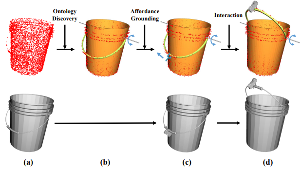
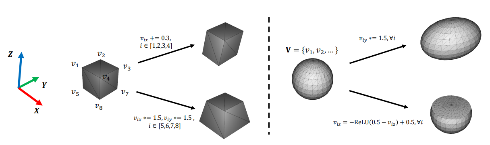
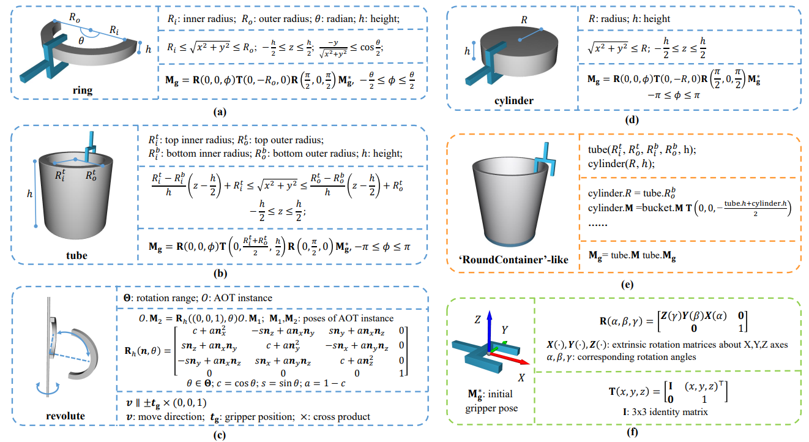
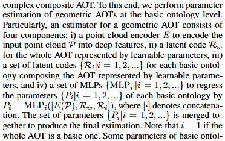

## 阅读笔记：Discovering Conceptual Knowledge with Analytic Ontology Templates for Articulated Objects

[文章链接](https://openreview.net/forum?id=b2ZOoojJOs&referrer=%5Bthe%20profile%20of%20Longfei%20Xu%5D(%2Fprofile%3Fid%3D~Longfei_Xu2))

### Abstract

人类认知可以利用几何学和运动学等基本概念知识来适当地感知、理解新物体并与之交互。受这一发现的激励，我们的目标是通过在概念层面上执行，赋予机器智能类似的能力，以便理解铰接的对象（articulated objects），然后与铰接的对象进行交互，特别是对于那些新类别的对象，由于复杂的几何结构和复杂的几何结构，这具有挑战性。铰接物体的多种关节类型。为了实现这一目标，我们提出了分析本体模板（AOT），这是广义概念本体的参数化和可微的程序描述。相应地设计了由 AOT 驱动的称为 AOTNet 的基线方法，为智能代理配备这些通用概念，然后使代理能够有效地发现有关铰接对象的结构和可供性的概念知识。 AOT 驱动的方法在三个关键方面带来好处：i）在不依赖任何真实训练数据的情况下实现对铰接对象的概念级理解，ii）提供分析结构信息，以及 iii）引入指示正确交互方式的丰富可供性信息（affordance）。我们进行了详尽的实验，结果证明了我们的方法在理解和与铰接物体交互方面的优越性。补充材料中提供了更多细节、额外分析和全面讨论。我们的代码（包括 AOT）将公开，以促进我们的想法在社区中得到更好的采用。

### What's Articulated Objects?

铰接物体（Xiang et al. 2020；Liu et al. 2022a）由通过关节互连的刚性部分组成，可以进行平移和旋转运动，在日常生活中发挥着重要作用。学习铰接物体在计算机视觉、机器人技术和具体人工智能等广泛的研究领域中具有重要意义。由于铰接物体复杂的几何结构和多样的关节类型（Xiang et al. 2020；Mo et al. 2021），与看不见的铰接物体进行交互以实现机器智能具有挑战性，特别是对于那些新类别的物体。

#### 拓展到脑科学

人类对大多数物体或物体的部分没有先验知识，在认知和脑科学层面上，来自**认知和脑科学的研究**（Carey and Xu 2001；Scholl and Leslie 1999；Leslie et al. 1998；Piaget 1955；Ullman 2000；Biederman 1987；Hummel and Biederman 1992）表明，我们仍然能够找到他们的几何结构，并进一步理性地与他们互动，依靠基本的概念知识。这一发现为机器智能从概念角度与新颖的铰接物体交互建立了一种可能的方式。然而，在数据驱动时代，之前的工作很少深入研究这个领域。对婴儿的研究（Carey and Xu 2001；Scholl and Leslie 1999）进一步揭示了概念知识在物体理解中的关键意义，因为婴儿受经验因素的影响要小得多。

### Question

1. 如何描述机器智能的概念本体（how to describe a conceptual ontology for machine intelligence）
2. 如何利用概念描述来发现有关铰接对象的结构和可供性的概念知识 （how to leverage the conceptual descriptions to discover conceptual knowledge about the structure and affordance of articulated objects）

### Answer ( Solution )

#### 针对问题一（如何描述机器智能的概念本体）

设计AOT（Analytic Ontology Template），本质上是：

* Structure：一组可微的数学表达式，用于描述本体的内在基础。
* Parameter：结构描述中的变量值，用于标识该模板的特定实例。
* Affordance：关于在何处以及如何与其交互的本体的一些通用知识。[有关Affordance的概念](https://www.zhihu.com/question/19608055)，简单理解为环境对agent的可操作性的指导（？）。
* Renderer：用于将本体模板的实例渲染为某些格式的数据（例如点云、网格）的工具。也就是可视化。

#### 针对问题二（如何利用概念描述来发现有关铰接对象的结构和可供性的概念知识）

设计一个pipeline，将铰接物体从初始状态变成终止状态，举例如上图agent将handle从一侧移动到另一侧，图上上方一行表示pipeline，从发现本体（ontology）开始获取到AOT中的structure和parameter信息，接着分析到AOT的Affordance信息。

提出了新的baseline：AOTNet

### Key Advantages

* 认为从概念层面设计对可交互（也就是有Affordance）的铰接物体的agent操作，可以避免使用CAD等常用扫描工具导致的高昂工具成本和密集型劳动成本。因为从概念层面的设计使得具有很好的泛化能力（理解为球形物体和半球型物体对于AOT来说可以仅创造一个AOT class，因为半球相对于球相当于对y方向ReLu来convert，但是传统工具必须全部扫描）
  原文为：our approach shows advantages in both aspects in total. This can be attributed to i) AOTs are capable of adapting to different object categories since they are developed to describe generalized concepts, and therefore **a small amount of AOTs can cover the conceptual knowledge on many everyday objects**, ii) new AOTs can be easily expanded in an **inheritance** fashion by composing existing ones and iii) a single AOT can effortlessly create an infinite number of diverse synthetic data by rendering instances with different parameters.
* 不依赖真实数据参与训练，也是得益于泛化能力，看似不同类但可以通过设计AOT来实现，而不需要额外学习（CAD-Scan）数据

### Details in AOT

下图中展示了多种AOT的参数，结构和Affordance（这里的Affordance针对gripper设计也就是Mg，表示gripper的真实抓取位姿，是通过初始位姿Mg*计算得来的）

### Details in AOTNet

AOTNet的目的是验证AOT的可行性，baseline

具体分为：

1. 本体识别（ontology identification） ：对于静态模板（block）直接将点云数据PCD输入MLP进行分类，对于运动本体（kinematic ontology）需要先确定两帧PCD（运动本体可以理解成可运动方式，如绕轴旋转、平移，举例来说，上述tube的handle是一个绕轴旋转的AOT，AOTNet需要获取他的两帧运动过程中的PCD来判断他是旋转还是平移）作为初始状态和终止状态，将这些特征连接后交给MLP分类。
2. 参数估计（Parameter Estimation）：分类后，需要判断这些AOT的参数信息，AOT分为基础AOT和复合AOT（见上图(e)）。现在没有代码可以看，没有理解paper中对于这里的表述（下图）
3. 可供性基础和交互（Affordance Grounding and Interaction）：简单操作--根据geometry Affordance使gripper holds articulated part，接着使用kinematic Affordance使gripper施加力。

### Conclusion

我们引入分析本体模板作为广义概念的描述，以赋予机器智能在概念层面上适当地感知、理解和与铰接对象交互，特别是对于那些新颖类别的对象。我们的主要贡献如下。首先，我们提出 AOT 作为广义概念本体的参数化且可微的模板描述，并且可以在模板中对可供性进行数字化描述，以实现准确且可控的交互。其次，相应地设计了一个名为 AOTNet 的 AOT 驱动管道，为智能代理配备这些概念，然后使代理能够有效地发现对象的结构和可供性的概念知识。第三，我们综合评估了 AOT 和 AOTNet 在多个类别的数百个铰接对象上在铰接概念发现方面的有效性。这些实验表明了 AOT 驱动范式的好处以及机器智能模仿人类在概念层面学习的能力的可能性。

we introduce Analytic Ontology Templates as the description for generalized concepts, in order to endow machine intelligence to appropriately perceive, comprehend
and interact with articulated objects at the conceptual level, especially for those in novel categories. Our main contributions are as follows. First, we propose Analytic Ontology Template as a parameterized and differentiable template description of a generalized conceptual ontology, and affordances can be numerically described in the template for accurate and controllable interactions. Second, an AOT-driven pipeline called AOTNet is designed accordingly to equip intelligent agents with these concepts, and then empower the agents to effectively discover the conceptual knowledge of structure and affordance on objects. Third, we comprehensively evaluate the effectiveness of AOT and AOTNet on hundreds of articulated objects across a wide range of categories in terms of articulated concept discovery. The experiments suggest the benefits of the AOT-driven paradigm and the possibility for machine intelligence to mimic the kind of human capability that learning at the conceptual level.

### Future Work

* 在训练过程中融入真实世界的数据，因为现在的AOTNet仅仅使用了AOT的合成数据（不是真实采集的，但是是通过可微分计算convert的）
* 🔑 没有强调几何细节，考虑在point-level对原始形状数据和AOT数据进行整合（是否和之前安排的focus on task-based parts to get specialized data有关？）
