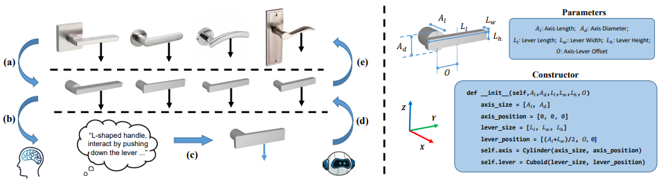
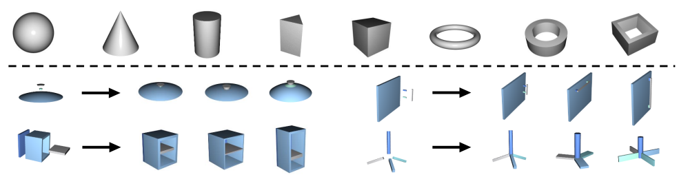
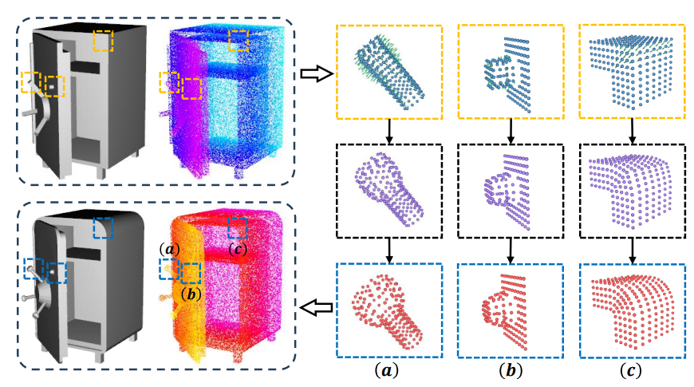
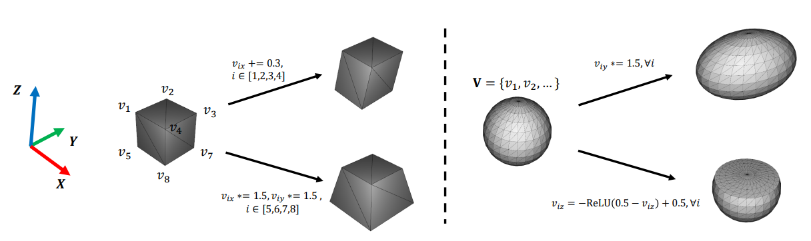
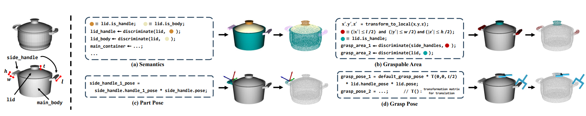

## 阅读笔记：ConceptFactory: Facilitate 3D Object Knowledge Annotation with Object Conceptualization

[文章链接](https://openreview.net/pdf?id=iACMjECRjV)

## Abstract (Be Enlighten by What)

提供了一个DB，也可以说是获取data的注释annotation方法

Inspirited by: **the findings in human cognition research that the perceptual recognition of objects can be explained as a process of arranging generalized geometric components 对物体的感知识别可以解释为排列广义几何组件**--Biederman I. Recognition-by-components: a theory of human image understanding. Psychol Rev. 1987 Apr;94(2):115-147. doi: 10.1037/0033-295X.94.2.115. PMID: 3575582**.**

ConceptFactory由两部分组成：

* ConceptFactory suite：文中说是针对web-based的平台设计的Standard Concept Templates Library(STL-C)，是利用py文件设计的类模板，在给定参数后可以实例化描述3D形状的Concept instance。
* ConceptFactory assets：也就是利用设计好的web-based的平台获取的数据

Note：文中提到的generalized geometric concepts == object conceptualizations

文中说优势是较于传统标注方法需要对每一种都进行注释，本方法可以针对template-level进行注释，减少劳动力成本（这里我需要更详细的说明）；并且与传统注释获得的data质量（针对于当前SOTA方法用起来的效果来评判）相当，在各种baseline上有效

## Review & Rebuttal

### 优势

* 显着减少注释 3D 对象所需的时间和人力，也就是减少大量手动注释工作的需要
* 该方法受到人类认知中的“Recognition-by-components”理论的启发，该理论增加了理论基础，并使注释过程与人类感知机制保持一致

### 问题（解答）

* ~~难以处理高度复杂和不规则的物体，这些物体不能完全符合预定义的几何概念，需要细粒度的语义理解~~；解答：details on geometry 不会影响 object 的 affordance，加上现在的concept是基于完备的数学逻辑的，可继承性和泛化性很强。[补充pdf](https://openreview.net/attachment?id=E66GhF6xF9&name=pdf)
* ~~获取新对象的层次结构或部分隔离/组合，即进行的是对object mesh的segregate to part mesh~~；解答：并不是对object mesh层面进行分割，我觉得这个reviewer受到了PartNet的影响，本文做出的是从concept templates层面进行搭积木的过程（通俗来说，可能会存在mesh和mesh之间部分面的overlay），但能保证各个mesh对应的template的完整性。reviewer给我的感觉是从真实物体直接扫描得到的surface mesh来考虑的，是自顶向下；本文是自底向上。
* ~~认为功能上和URDF（统一机器人描述文件）有重叠~~；解答：本文聚焦的是针对物体conceptualization设计可得到的affordance，并不是提供了一种新的注释数据结构
* ~~与之前的标注方法比，高效注释是唯一优势吗~~；解答：还可以为以前手动注释极其复杂的类型提供高质量的注释，但随着注释增多，效率确实变得非常重要。

## Conclusions from Related Work

* Biederman 发现，物体的感知识别被概念化为一个过程，其中物体被分割成简单几何组件的排列，例如块、圆柱体、楔子和圆锥体【Irving Biederman. Recognition-by-components: a theory of human image understanding. Psychological review, 94(2):115, 1987】
* 教导机器智能理解3D物体并使其能够感知物体并与物体交互非常重要，视觉任务聚焦于部分分割part segmentation -- 将各种类型的预定义标签分配给对象上的点，位姿估计聚焦于查询物体上检测到的部位的 6 维变换，推断它们的尺度、旋转和位置。重点在于对铰接物体的认知和操作（这里的铰接物体articulated objects可以看[另一篇](./2024-11-12-blog-post-1.md)）
* 3D object DB: ShapeNet / ShapeNetPart（提供了跨 16 个类别的模型的部件级语义分割） / PartNet（提供了跨 24 个类别的细粒度分割） / PartNet-Mobility（带有 URDF 风格的注释，它为铰接对象添加了关节信息） / GAPartNet（提供了可泛化和可操作部分 (GAParts) 的注释）

## What's Concept & Why Concept

我们人类通过感知几何模式来了解物理世界并归纳出相关知识作为常识，以备将来参考（先验知识）。基于这些发现，我们通过将此类抽象常识信息显式建模为规则几何图案的概念并反转归纳过程，为对象理解任务建立了一种新颖的知识注释范式。

上图的[Right]描述了STL-C的结构，由参数和构造函数组成

上图的[Top]是几何形状instances（geometric instances），[Bottom]是由特定参数控制的concept instances

## Python Templates: STL-C (Standard Concept Templates Library)

分为两个部分：

* 几何模板：对于常用几何设计统一的模板（这里有泛化能力）
* 概念模板：构建概念模板作为几何图案的描述符。具体而言，每个概念模板通过在嵌入图案中的特定约束下组装各种模板来明确地描绘几何图案。这样的约束将在概念模板的参数化过程中显现出来。也就是说，概念模板的参数将在约束定义的规则下进行处理，以生成成员几何模板的参数，然后相应地实例化为概念实例的一部分。特别是，在描述周期性模式时，我们引入了额外的离散参数来指定几何实例中的重复次数。

这张图说明了真实物体和其conceptualization之间的gap，以及通过BPS方法实现从conceptualization到real的转换：具体来说，对于物体表面上的每个点 x，我们在concept instances上找到一个对应的点 y，使 L(x, y) 最小化。通过建立这种对应关系，我们可以通过对 y 应用变形 (x − y) 来恢复对象概念描述的几何细节。[point-level]

## Web-based Annotation System: Conceptualization Platform

这里忽略文章中提到的关于平台的具体细节，重点看其中设计到的Concept Parameter Optimizer(CPO)

### Concept Parameter Optimizer

参数优化

上图表示提供的template instances 也可以通过可微分进行可微变换，但也是同一个geometric instance template，大大提高泛化能力

同时定义了基于区域的知识注释。将基于区域的知识视为对象上标记区域的集合，最常见的例子是语义分割。为了实现基于区域的知识注释，用户可以将区域描述实现为区域判别函数，该函数决定给定点是否位于概念实例的指定区域内。

这张图说明了

1. 基于区域的知识（图上的(a)和(b)）-- 如语义和affordance的区域，是通过区域区分discrimination功能来实现的
2. 基于姿势的知识（图上的(c)和(d)）-- 如零件姿势和抓取姿势，是通过从本地坐标到世界坐标的转换来实现的
