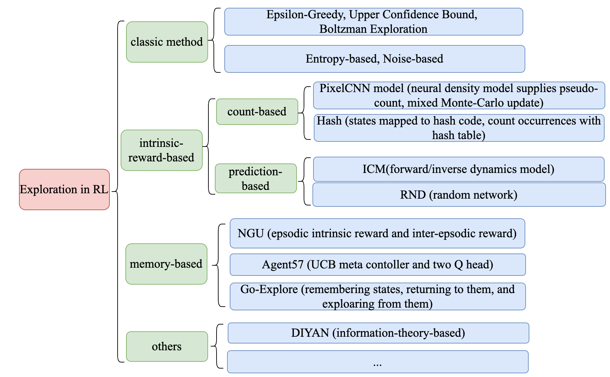
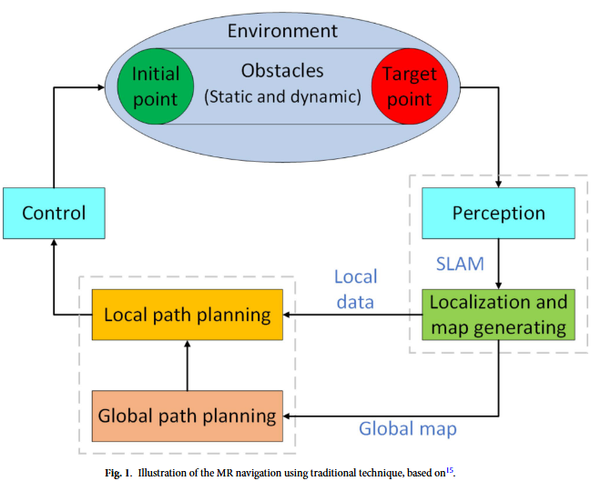

# Navigation 专题 —— Intelligent mobile robot navigation in unknown and complex environment using reinforcement learning technique

Created on 2025-01-18

# 个人认为这篇文章太粗糙了，不适合阅读学习。 footnote here.

文章只是用了 强化学习 和 Mobile Robot的概念做了这个理，没么偶有看出新颖点。

## abstract

强化学习 + 神经网络收敛

奖励旨在鼓励机器人朝着目标前进，同时避开障碍。在这项工作中，深度 Q 学习（QL）代理用于使机器人能够自主学习以避免与障碍物碰撞并增强未知环境中的导航能力。当在陌生区域独立操作MR时，使用强化学习模型来识别目标位置，并使用深度Q网络（DQN）导航到目标位置。使用 Epsilon-Greedy 算法进行模拟来评估我们的方法。

    To complete a predetermined work, the MR generally goes through three phases: perception(sensing), path planning and synthesis (process), and motion (action).

移动机器人必须能够自主导航未知区域，同时避开静态和移动障碍物。经典方法和启发式方法都被用来开发 MR 的操作技术。当环境变得更加复杂时，传统方法可能会变得令人厌烦，并且可能无法产生最佳结果。如今，研究人员越来越多地选择启发式方法，因为它们在很大程度上模仿了人类习得行为的方式。最著名的启发式方法是强化学习 (RL)，它经常用于 MR 导航。观察到的围绕障碍物的旋转角度被细化使用基于 RL 的控制器。 RL 方法允许 MR 根据过去的行为来识别路线。

## 文献调查（初版）

~~

# Citation
Raj, R., Kos, A. Intelligent mobile robot navigation in unknown and complex environment using reinforcement learning technique. Sci Rep 14, 22852 (2024). https://doi.org/10.1038/s41598-024-72857-3